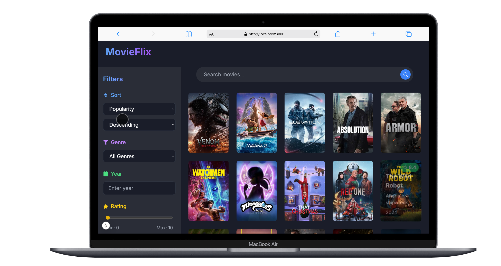
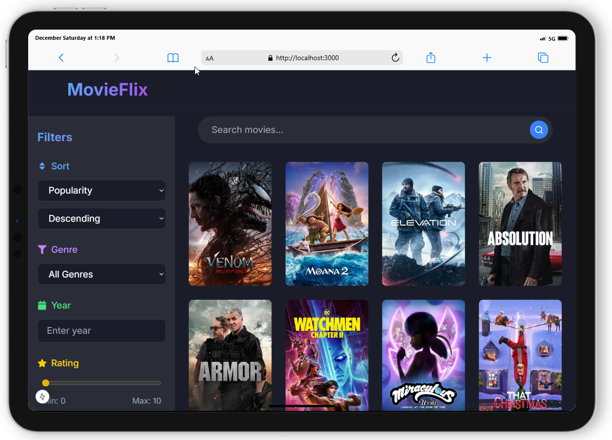
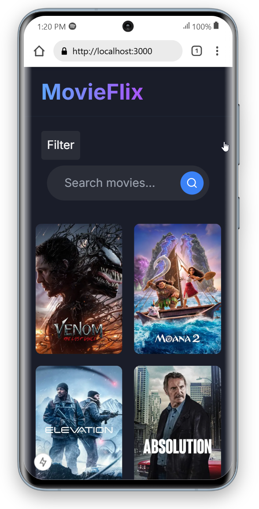

# [MovieFlix - Modern Movie Discovery Platform 🎮](https://discoverflix.netlify.app/)

[Discover Now](https://discoverflix.netlify.app/)

A sleek and responsive movie discovery platform built with Next.js, React Query, and TMDB API. Browse, search, and filter through thousands of movies with a modern UI optimized for all devices.

## ✨ Features

- 🎯 Real-time movie search with debouncing
- 🔍 Advanced filtering by genre, year, rating, and sort options
- 📱 Fully responsive design with a mobile-first approach
- 🚀 Infinite scroll for seamless movie browsing
- ⚡️ Optimized performance with React Query caching
- 🎨 Modern UI with hover animations and transitions
- 🌃 Dark mode optimized interface
- 🔄 Dynamic movie data from TMDB API
- ✅ Fully typed with TypeScript
- 🧫 Comprehensive test coverage

## 🚀 Getting Started

1. Clone the repository:

   ```bash
   git clone https://github.com/tanverified/movies.git
   ```

2. Install dependencies:

   ```bash
   npm install
   ```

3. Create a `.env.local` file in the root directory:

   ```env
   NEXT_PUBLIC_TMDB_API_KEY=your_api_key_here
   NEXT_PUBLIC_TMDB_BASE_URL=https://api.themoviedb.org/3
   ```

   Get your API key from [TMDB API](https://www.themoviedb.org/settings/api).

4. Start the development server:

   ```bash
   npm run dev
   ```

5. Open [http://localhost:3000](http://localhost:3000) in your browser.

## 📸 Screenshots

### Desktop View



### Tablet View



### Mobile View



## 🛠️ Tech Stack

- **Framework:** Next.js 15 with React 19
- **State Management:** React Query
- **Styling:** Tailwind CSS
- **Language:** TypeScript
- **Testing:** Vitest
- **API:** TMDB API
- **Icons:** React Icons
- **Image Optimization:** Next/Image
- **HTTP Client:** Axios

## 🧪 Testing

Run tests:

```bash
npm run test
```

Run with coverage:

```bash
npm run test:coverage
```

## 📦 Build

Create a production build:

```bash
npm run build
```

Start the production server:

```bash
npm run start
```

## 🎯 Core Components

- **`MovieList`:** Main component for displaying the movie grid
- **`FilterBar`:** Advanced filtering options
- **`SearchBar`:** Real-time movie search
- **`MovieCard`:** Individual movie display with hover effects
- **`LoadMoreButton`:** Infinite scroll trigger

## 🔍 Key Features in Detail

### Search Functionality

- Real-time search with debouncing
- Instant results update
- Clear search option

### Filter Options

- Sort by popularity, release date, rating, title
- Filter by genre
- Year selection
- Minimum rating filter
- Sort direction (asc/desc)

### Movie Display

- High-quality poster images
- Hover effect with movie details
- Rating badge with color indicators
- Release year display
- Movie overview on hover

### Responsive Design

- Mobile-first approach
- Collapsible filter sidebar on mobile
- Grid layout adaptation for different screens
- Touch-friendly interactions

### UI/UX Features

- Smooth transitions and animations
- Loading skeletons for better UX
- Error handling with user feedback
- Infinite scroll with loading indicators
- Responsive grid layout
- Hover effects and transitions

## 📱 Responsive Breakpoints

- **Mobile:** < 768px
- **Tablet:** 768px - 1024px
- **Desktop:** > 1024px

## 🔧 Configuration

The app uses the following environment variables:

```env
NEXT_PUBLIC_TMDB_API_KEY=your_api_key
NEXT_PUBLIC_TMDB_BASE_URL=https://api.themoviedb.org/3
```

## 🌐 API Integration

- TMDB API for movie data
- Cached responses with React Query
- Error handling and retries
- Rate-limiting consideration

## 📈 Performance Optimizations

- Image optimization with Next/Image
- React Query caching
- Debounced search
- Lazy loading with infinite scroll
- Component code splitting

## 🤝 Contributing

1. Fork the repository
2. Create your feature branch
3. Commit your changes
4. Push to the branch
5. Open a pull request

## 👌 License

This project is licensed under the MIT License.

---

Made with ❤️ by Tanveer

[GitHub Repository](https://github.com/tanverified/movies.git)
